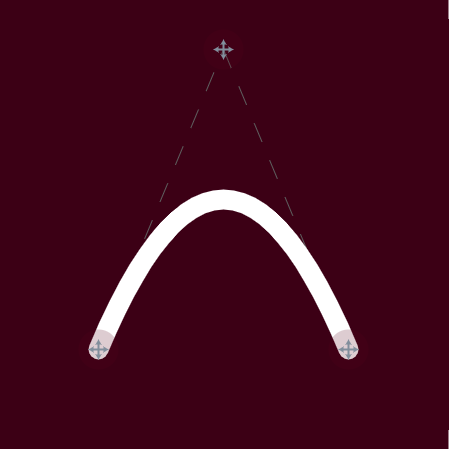

Interactive arc, cubic bezier and quadratic bezier curves with SVG source code, implemented using React, Redux and RxJS.

[https://hunormarton.github.io/svg-curves/](https://hunormarton.github.io/svg-curves/)

## Arc


```html
<svg width="450" height="450" xmlns="http://www.w3.org/2000/svg" >
  <path d="M 145 174 A 150 120 20 0 0 288 314" stroke="white" stroke-width="20" fill="none" />
</svg>
```

## Cubic Bezier


```html
<svg width="450" height="450" xmlns="http://www.w3.org/2000/svg" >
  <path d="M 100 350 C 70 100, 380 100, 350 350" stroke="white" stroke-width="20" fill="none" />
</svg>
```

## Quadratic Bezier


```html
<svg width="450" height="450" xmlns="http://www.w3.org/2000/svg" >
  <path d="M 100 350 Q 225 50, 350 350" stroke="white" stroke-width="20" fill="none" />
</svg>
```

## Made by
Hunor Márton Borbély

2018
